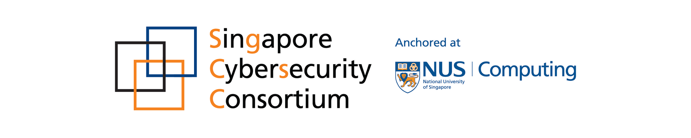

# Research Forum

## Overview

The research forum aims to bring together students, researchers and
practitioners, showcasing developments at the intersection of
deep learning and security. The forum is part of a two-day
[event](https://deep-learning-security.github.io/) in
Singapore on Dec 14th and 15th. This forum invites submissions for
'work-in-progress' or short research talks.  Talks can include
emerging hot topics, preliminary research results, practical
problems encountered by industry practitioners, lessons
learned, exciting datasets, and other topics of interest to
security researchers working in deep learning.

## Participation

To participate as a speaker, please submit a research short paper as per the submission guidelines below. Submissions
can be authored by teams. The organizing committee will
select a set of finalist teams, who will be invited to
present their work in-person at the forum on Dec 14 and during the lightning talk and  poster session on Dec 15. Submissions and talks will be
divided into 3 tracks:

**Datasets**: Showcasing the creation of new datasets
to spur research activity

**Real-world Applications**: Showcasing interesting
real-world applications of deep learning in security

**Models, Techniques, Attacks, and others:** Showcasing research
on new deep learning models, techniques for analysis of
models, adversarial learning techniques, privacy-preserving
deep learning, attacks on deep learning systems, and other topics of interest. 

 The forum will include an
evening networking session open to all attendees, invited
companies, and students from universities in Singapore. 

## Scholarship and Awards

For accepted short papers, the forum
will be offering scholarships for a number of students, researchers, and practitioners
invited as speakers to cover costs of travel and stay for
the event. 

In addition, presentations in each track will be evaluated for one or more
awards by the organizing committee. The Award ceremony will take place on Dec 15 during the main workshop event. Awardees will be invited
to present their work during the ceremony. 

## Submission

Submission guidelines and deadlines: All talk proposal
submissions are expected to be in ACM style double-column,
10-point format to merit consideration by the organizers.
The submission should contain a mainbody with up to 4 pages
of content, in addition with an unlimited appendix including
the curriculum vitas of all authors. The CV for each author
should be limited to 1 page only.

Submissions are due on November 5th, 2017 11:59 pm PST.

[Submission website is open!](https://easychair.org/conferences/?conf=dlsrf17)

The final acceptance notification for the main talks will be
within one week of the submission deadline. Submissions will be
judged on novelty, practical relevance and technical depth.
For any questions about submitting a short paper, please contact <dlsrf17@easychair.org>.

For more information and future announcements about the
Research Forum, [sign up on the mailing list](https://groups.google.com/d/forum/deep-learning-security-research-forum).

## Co-chairs

Chang Liu, University of California, Berkeley

Jernej Kos, Zheng Leong Chua, National University of Singapore

## Schedule

To be determined.

# Sponsors

