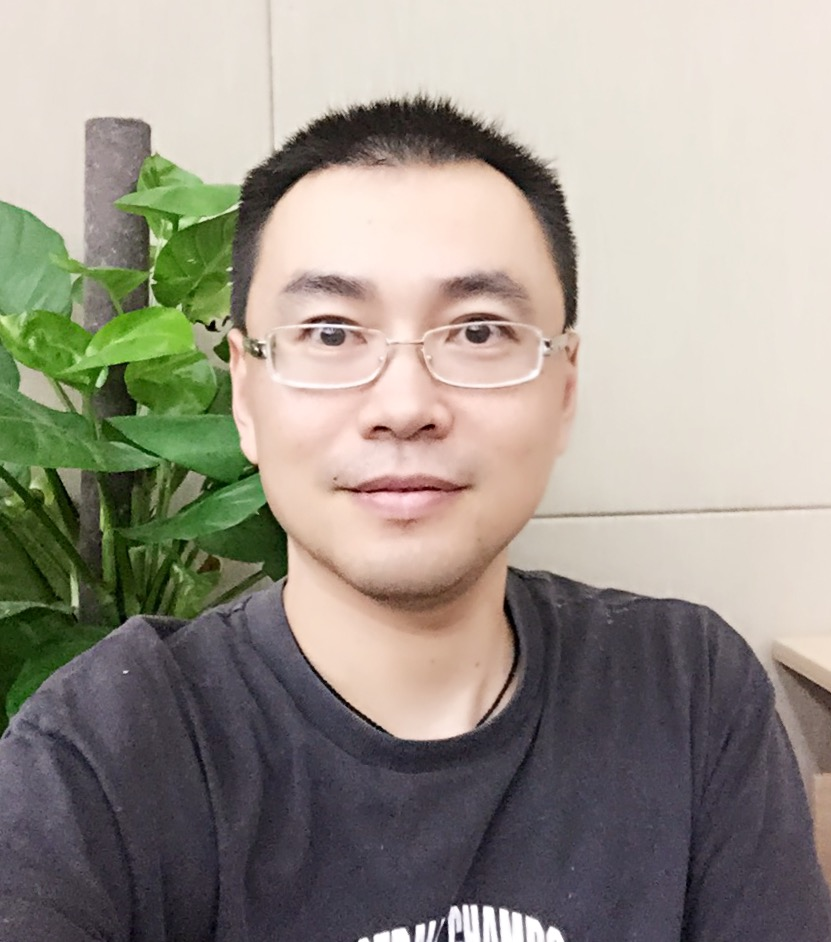

Speakers
===================

|   |   |   |
|---|---|---|
|{::nomarkdown}{:/} | __John Whaley__   UnifyID |
{: .tablelines}
>John Whaley is Founder and CEO of UnifyID. He was previously Founder and CTO of Moka5, and was a Visiting Lecturer in Computer Science at Stanford. He is an expert in computer security and has spoken at numerous conferences and industry events. He holds a doctorate in computer science from Stanford University, where he made key contributions to the fields of program analysis, compilers, and virtual machines. He is the winner of numerous awards including the Arthur L. Samuel Thesis Award for Best Thesis at Stanford, and has worked at IBM’s T.J. Watson Research Center and Tokyo Research Lab. John was named one of the top 15 programmers in the USA Computing Olympiad. He also holds bachelor’s and master’s degrees in computer science from MIT. 

|   |   |   |
|---|---|---|
|{::nomarkdown} {:/} | **Le Song**  Georgia Institute of Technology |
{: .tablelines}
>Le Song is an Associate Professor in the Department of Computational Science and Engineering, College of Computing, and an Associate Director of the Center for Machine Learning, Georgia Institute of Technology. Le is also working in the Ant Financial AI Department on risk management and security related problems. He received his Ph.D. in Machine Learning from University of Sydney and NICTA in 2008, and then conducted his post-doctoral research in the Department of Machine Learning, Carnegie Mellon University, between 2008 and 2011. Before he joined Georgia Institute of Technology in 2011, he was a research scientist at Google briefly. His principal research direction is machine learning, especially nonlinear models, such as kernel methods and deep learning, and probabilistic graphical models for large scale and complex problems, arising from artificial intelligence, network analysis and other interdisciplinary domains. He is the recipient of the Recsys’16 Deep Learning Workshop Best Paper Award, AISTATS'16 Best Student Paper Award, IPDPS'15 Best Paper Award, NSF CAREER Award’14, NIPS’13 Outstanding Paper Award, and ICML’10 Best Paper Award. He has also served as the area chair or senior program committee for many leading machine learning and AI conferences such as ICML, NIPS, AISTATS, AAAI and IJCAI. He is also the action editor for JMLR, and associate editor for IEEE PAMI. 

|   |   |   |
|---|---|---|
|{::nomarkdown} {:/} | **Ian Fischer**  Google Research |
{: .tablelines}
> Ian Fischer is a Machine Learning researcher at Google.  His recent work spans topics in computer vision, adversarial machine learning and robustness, generative models, and reinforcement learning.

|   |   |   |
|---|---|---|
|{::nomarkdown} {:/} | **Reza Shokri**  National University of Singapore |
{: .tablelines}
> Reza Shokri is a computer science assistant professor at National University of Singapore. He is an active member of the security and privacy community, and his research focuses on data and computational privacy. He received his PhD from EPFL.

|   |   |   |
|---|---|---|
|{::nomarkdown} {:/} | **Liang Shi**   Alibaba Cloud Security |
{: .tablelines}
> Liang Shi, currently a Staff Expert&Manager of Security Data Science team from Alibaba Clound Security, worked as Sr. Data Scientist for Pivotal, Sr. Security Researcher for Intel Security, and Software Engnineer for Microsoft. He concentrates on security R&D by machine learning and data mining. He got his Ph.D. in computer science and M.S. in statistics from University of Georgia.  

|{::nomarkdown} {:/} | **Tianlong Liu**   Alibaba Cloud Security |
{: .tablelines}
> Tianlong Liu  is a Senior Algorithm Engineer working in Alibaba Cloud Security.The primary area of focus for his work has been in machine learning and deep learning. He got his M.S. in software engineering from South China University of Technology.

|{::nomarkdown} {:/} | **Min Ye**   Alibaba Cloud Security |
{: .tablelines}
> Min Ye is a Senior Security Expert at Alibaba Cloud. He leads Alibaba Cloud’s security research team, which has done extensive research on security attacks and defenses to improve their security products. His fields of interest include intrusion detection and prevention, web security,  malware analysis, and security dada analysis. Currently he is mainly focused on applying machine learning to attack and malware detection.
